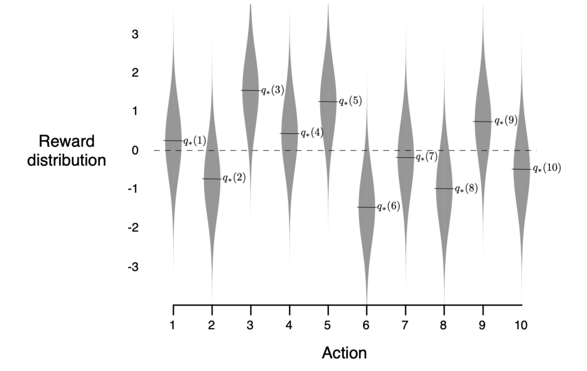
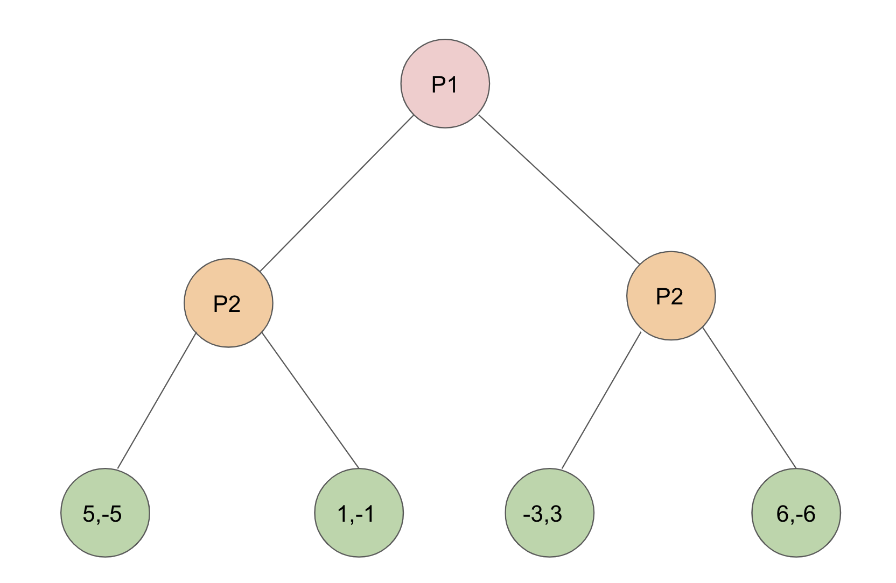
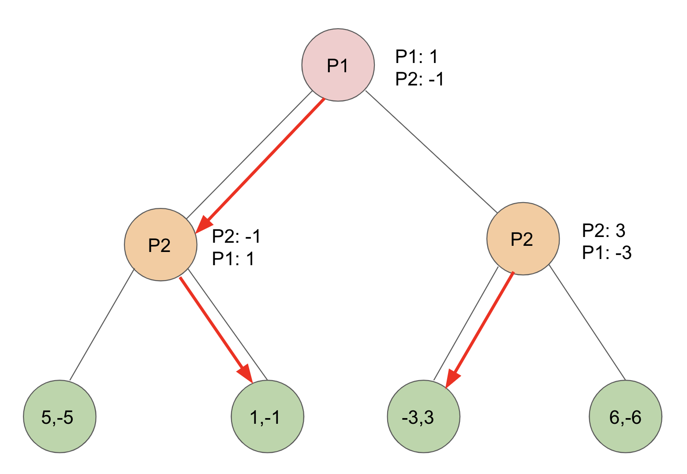

## Intro
This tutorial is made with two target audiences in mind: (1) Those with an interest in poker who want to understand how AI poker agents are made and (2) Those with an interest in coding who want to better understand poker and code poker agents from scratch. 

## Table of Contents
[1. Poker Background](#1-poker-background)<br>
[2. History of Solving Poker](#2-history-of-solving-poker)<br>
[3. Game Theory -- Equilibrium and Regret](#3-game-theory----equilibrium-and-regret)<br>
[4. Solving Toy Poker Games from Normal Form to Extensive Form](#4-solving-toy-poker-games-from-normal-form-to-extensive-form)<br>
[5. Trees in Games](#5-trees-in-games)<br>
[6. Toy Games and Python Implementation](#6-toy-games-and-python-implementation)<br>
[7. Counterfactual Regret Minimization (CFR)](#7-counterfactual-regret-minimization-cfr)<br>
[8. Game Abstraction](#8-game-abstraction)<br>
[9. Agent Evaluation](#9-agent-evaluation)<br>
[10. CFR Advances](#10-cfr-advances)<br>
[11. Deep Learning and Poker](#11-deep-learning-and-poker)<br>
[12. AI vs. Humans -- What Can Humans Learn?](#12-ai-vs-humans----what-can-humans-learn)<br>
[13. Multiplayer Games](#13-multiplayer-games)<br>
[14. Opponent Exploitation](#14-opponent-exploitation)<br>
[15. Other Games (Chess, Atari, Go, Starcraft, Dota, Hanabi)](#15-other-games-chess-atari-go-starcraft-hanabi)<br>

## 1. Poker Background

### Brief History
Poker began at some point in the early 20th century and grew extensively in the early 2000s thanks to the beginnings of online poker (the first hand ever was dealt on January 1, 1998), which lead to an accountant and amateur poker player named Chris Moneymaker investing $39 in an online satellite tournament that won him a $10,000 seat at the World Series of Poker Main Event in 2003, alongside 838 other entrants. Moneymaker went on to defeat professional poker player Sam Farha at the final table of the tournament and won $2.5 million. A poker boom was sparked and led to massive player pools on the Internet and in subsequent World Series’ of Poker.


https://www.pokernews.com/strategy/teaching-poker-to-beginners-with-chris-moneymaker-29704.htm

After the human poker boom, computers also started getting in on the poker action. Researchers began to study solving Texas Hold’em games in 2003, and since 2006, there has been an Annual Computer Poker Competition (ACPC) at the AAAI Conference on Artificial Intelligence in which poker agents compete against each other in a variety of poker formats. In early 2017, for the first time, a NLHE poker agent defeated and is considered superior to top poker players in the world in 1v1 games.

### Basic Rules
Poker is a card game that, in its standard forms, uses a deck of 52 cards composed of four suits (Clubs :clubs:, Diamonds :diamonds:, Hearts :heart:, and Spades ::spades::) and 13 ranks (Two through Ten, Jack, Queen, King, and Ace). A dealer button rotates around the table indicating who is the “dealer”. This is decided at random for the first hand and rotates clockwise after that. All actions begin to the left of the hand’s current dealer player.

We will focus on two player games and ignore any fees (also known as rake) such that the games will be zero-sum (all money won by one player is lost by the other). The two players play a match of independent games, also called hands, while alternating who is the dealer.

Each game goes through a series of betting rounds that result in either one player folding and the other winning the pot by default or both players going to “showdown”, in which the best hand wins the pot. The pot accumulates all bets throughout the hand. The goal is to win as many chips from the other player as possible.

Betting options available throughout each round are: fold, check, call, bet, and raise. Bets and raises generally represent strong hands. A bluff is a bet or raise with a weak hand and a semi-bluff is a bet or raise made with a currently non-strong hand that has good potential to improve. 

**Fold:** Not putting in any chips and "quitting" the hand by throwing the cards away and declining to match the opponent's bet or raise. Done only after an opponent bet or raise. <br>
**Check:** A pass, only possible if acting first or if all previous players have also checked<br>
**Call:** Matching the exact amount of a previous bet or raise<br>
**Bet:** Wagering money (putting chips into the pot) when either first to act or the opponent has checked, which the opponent then has to call or raise to stay in the pot<br>
**Raise:** Only possible after a bet, adding more money to the pot, which must be at least the amount of the previous bet or raise (effectively calling and betting together)

### Kuhn (1-card) Poker
Kuhn Poker is the most basic useful poker game that is used in computer poker research. It was solved analytically by hand by Kuhn in 1950 [6]. Each player is dealt one card privately and begins with two chips. In the standard form, the deck consists of only three cards – an Ace, a King, and a Queen, but can be modified to contain any number such that the cards are simply labeled 1 through n, with a deck of size n. Our first experiment will use a deck size of 100 to compare different CFR algorithm implementations.

Players each ante 1 chip (although most standard poker games use blinds, this basic game does not) and rotate acting first, and the highest card is the best hand. With only 1 chip remaining for each player, the betting is quite simple. The first to act has the option to bet or check. If he bets, the opponent can either call or fold. If the opponent folds, the bettor wins one chip. If the opponent calls, the player with the higher card (best hand) wins two chips.

If the first to act player checks, then the second player can either check or bet. If he checks, the player with the best hand wins one chip. If he bets, then the first player can either fold and player two will win one chip, or he can call, and the player with the best hand will win two chips.


### What happened to online poker?

#### All Kuhn Poker Sequences


### Leduc Poker
Leduc Poker is a simple toy game that has more in common strategically with regular Texas Hold'em. 

**Deck size:** 6 cards -- 2 Jacks, 2 Queens, 2 Kings<br>
**Rounds:** 2 rounds -- 1 private card preflop, 1 community flop card<br>
**Blinds/Antes:** $1 ante<br>
**Betting structure:** All bets $2 in the first round and $4 in the second round with a limit of one bet and one raise per round<br>
**Starting 

Each betting round follows the same format. The first player to act has the option to check or bet. When betting the player adds chips into the pot and action moves to the other player. When a player faces a bet, they have the option to fold, call or raise. When folding, a player forfeits the hand and all the money in the pot is awarded to the opposing player. When calling, a player places enough chips into the pot to match the bet faced and the betting round is concluded. When raising, the player must put more chips into the pot than the current bet faced and action moves to the opposing player. If the first player checks initially, the second player may check to conclude the betting round or bet. In Leduc Hold’em there is a limit of one bet and one raise per round. The bets and raises are of a fixed size. This size is two chips in the first betting round and four chips in the second.

#### Example Leduc Poker Hand

### Texas Hold'em Poker
Each hand starts with the dealer player posting the small blind and the non-dealer player posting the big blind. The blinds define the stakes of the game (for example, a $1-$2 stakes game has blinds of $1 and $2) and the big blind is generally double the small blind. They are called blinds because they are forced bets that must be posted “blindly”. The player to the left of the big blind, in this case the dealer player, begins the first betting round by folding, calling, or raising. (In some games antes are used instead of or in addition to blinds, which involves each player posting the same ante amount in the pot before the hand.)

Each hand in Texas Hold’em consists of four betting rounds. Betting rounds start with each player receiving two private cards, called the “preflop” betting round, then can continue with the “flop” of three community cards followed by a betting round, the “turn” of one community card followed by a betting round, and a final betting round after the fifth and final community card, called the “river”. Community cards are shared and are dealt face up.

In no limit betting, the minimum bet size is the smaller of the big blind or a bet faced by the player and the maximum bet size is the amount of chips in front of the player. In the case of a two-player game, the dealer button pays the small blind and acts first preflop and then last postflop.
In limit betting, bets are fixed in advance based on the stakes of the game and the blinds. For example, with 2-4 blinds, the bets preflop and on the flop are 4 and on the turn and river, they are doubled to 8. In limit betting, there is a maximum of four bets and raises per betting round per player, which, in addition to the limited available set of actions, makes limit-based games significantly smaller than their no-limit counterparts.
On each round, players combine their private cards with the community cards to form the best possible 5-card poker hand, which could include 0, 1, or 2 private cards.

#### Example Texas Hold'em Poker Hand


### Summary of Games


## 2. History of Solving Poker
In 1951, John Nash wrote: "The study of n-person games for which the accepted ethics of fair play imply non-cooperative playing is, of course, an obvious direction in which to apply this theory. And poker is the most obvious target. The analysis of a more realistic poker game than our very simple model should be an interesting affair."

A main interest in games like poker comes from the fact that it is a game of imperfect information. Unlike games of perfect information (e.g. chess) where all information is visible to all players, in poker there is hidden information (opponent player private cards). 

The history of poker solving techniques have gone from rule/formula based to simulation based to, most recently, game theoretical. Game theoretical techniques have evolved by (a) using Monte Carlo techniques so that we don't need to traverse the entire game tree to update the game information and strategies and (b) abstraction


A short timeline of the major milestones in computer poker research is given here:

1998: Opponent Modelling in Poker, Billings et al. (Alberta)
A basic rule-based system was developed in 1999 in the University of Alberta Computer Poker Research Group (CPRG), which took an effective hand-strength as input and outputted a (fold, call, raise) probability triple, using a form of basic opponent modelling. 

2000: Abstraction Methods for Game-Theoretic Poker, Shi and Littman

2003: Approximating Game-Theoretic Optimal Strategies for Full-scale Poker, Billings et al. (Alberta)

2005: Optimal Rhode Island Poker, Gilpin and Sandholm (CMU)

2007: Regret Minimization in Games with Incomplete Information, Zinkevich et al (Alberta)
This hugely important paper introduced the Counterfactual Regret Minimization algorithm, which is the main algorithm used today for finding game-theoretic optimal strategies in poker games. 

MCCFR

2008-9: Man vs. Machine Limit Texas Hold'em Competitions

2015: Heads-up Limit Hold'em Poker is Solved, Bowling et al (Alberta)

2015: Brains vs. AI No-Limit Texas Hold'em Competition

2017: DeepStack: Expert-Level Artificial Intelligence in No-Limit Poker (DeepMind)

2017: Libratus and Man vs. Machine Competition

2019: Superhuman AI for Multiplayer Poker, Brown and Sandholm (CMU)


## 3. Game Theory -- Equilibrium and Regret
Let's look at some important game theory concepts before we get into actually solving for poker strategies. 

What does it mean to "solve" a poker game? In the 2-player setting, this means to find a Nash Equilibrium strategy for the game. If both players are playing this strategy, neither would want to change to a different strategy, since neither could do better with any other strategy (assuming that the opponent's strategy stays fixed). 

Intuition for this in poker can be explained using a simple all-in game where one player must either fold or bet all his chips and the second player must either call or fold if the first player bets all the chips. In this scenario, the second player may begin the game with a strategy of calling a low percentage of hands. After seeing the first player go all-in very frequently, he may increase that percentage. This could lead the first player to reduce his all-in percentage. Once the all-in percentage and the call percentage stabilize such that neither player can unilaterally change his strategy to increase his profit, then the equilibrium strategies have been reached.

Call with enough hands to make opponent worse off in allin hands

But what if the opponent, for example, keeps calling this low percentage of hands and seems to be easy to exploit? The game theoretic solution would not fully take advantage of this opportunity. The **best response strategy** is the one that maximally exploits the opponent by always performing the highest expected value play against their fixed strategy (and an exploitative strategy is one that exploits an opponent's non-equilibrium play). In the above example, this could mean raising all hands after seeing the opponent calling with a low percentage of hands. However, this strategy can itself be exploited. 

### Normal Form Games
Normal Form is writing the strategies and game payouts in matrix form. The Player 1 strategies are in the rows and Player 2 strategies are in the columns. The payouts are written in terms of P1, P2. When the sum of the payouts is 0, this is called a zero-sum game. Poker is an example of a zero-sum game since whatever one player wins the other player loses (assuming no rake, i.e, house commission). 

Here is a game example:

| P1/2  | Action 1  | Action 2  | Action 3  |
|---|---|---|---|
| Action 1  | 10, 2  | 8, 1  | 3, -1  |
| Action 2  | 5, 8  | 4, 0  | -1, 1  |
| Action 3  | 7, 3  | 5, -1  | 0, 3  |

A dominated strategy is one that is strictly worse than an alternative strategy. We can see that Player 1's strategy of Action 1 dominates Actions 2 and 3 because all of the values are strictly higher. 

When P2 chooses Action 1, P1 earns 10 with Action 1, 5 with Action 2, and 7 with Action 3
When P2 chooses Action 2, P1 earns 8 with Action 1, 4 with Action 2, and 5 with Action 3
When P2 chooses Action 3, P1 earns 7 with Action 1, 5 with Action 2, and 0 with Action 3

We also see that Action 1 dominates Action 2 for Player 2 and that Action 1 weakly dominates Action 3 for Player 2, since if Player 1 chooses Action 3, Player 2's Action 1 and Action 3 would be equal, rather than Action 1 being strictly greater. 

We can eliminate strictly dominated strategies and then arrive at the reduced Normal Form game: 

| P1/2  | Action 1  | Action 3  |
|---|---|---|
| Action 1  | 10, 2  | 3, -1  |

In this case, Player 2 prefers to play Action 1 since 2 > -1, so we have a Nash Equilibrium with both players playing Action 1 pure strategy and the payouts will be 10 to Player 1 and 2 to Player 2. 

| P1/2  | Action 1  |
|---|---|
| Action 1  | 10, 2  |

Here's one more example of a game. This time with two people who are going to watch something together. P1 has a preference to watch tennis and P2 prefers Power Rangers. If they don't agree, then they won't watch anything and will have payouts of 0. If they do agree, then the person who gets to watch their preferred show has a higher reward than the other, but both are positive. 

| P1/2  | Tennis  | Power Rangers   |
|---|---|---|
| Tennis  | 3, 2  | 0, 0  |
| Power Rangers  | 0, 0  | 2, 3  |

In this case, neither player can eliminate a strategy. For Player 1, if Player 2 chooses Tennis then he also prefers Tennis, but if Player 2 chooses Power Rangers, then he prefers Power Rangers as well (both of these are Nash Equilbrium). 

Let's call P(P1 Tennis) = p and P(P1 Power Rangers) = 1 - p. 

If Player 2 chooses Tennis, Player 2 earns $$ p*(2) + (1-p)*(0) = 2p $$

If Player 2 chooses Power Rangers, Player 2 earns $$ p*(0) + (1-p)*(3) = 3 - 3p $$

We can set these equal because a player will only play a mixed strategy when both strategies are equal (otherwise they would play a single best strategy), so $$ 2p = 3 - 3p ==> 5p = 3 ==> p = 3/5$$. Therefore $$1 - p = 2/5$$ and Player 1's strategy is to choose Tennis $$3/5$$ and Power Rangers $$2/5$$. This is a mixed strategy equilibrium because there is a probability distribution over which strategy to play. 

By symmetry, P2's strategy is to choose Tennis 2/5 and Power Rangers 3/5. 

So we have Tennis,Tennis occurring $$3/5 * 2/5 = 6/25$$
Power Rangers, Power Rangers $$2/5 * 3/5 = 6/25$$
Tennis, Power Rangers $$3/5 * 3/5 = 9/25$$
Power Rangers, Tennis $$2/5 * 2/5 = 4/25$$

The final payouts to each player are $$6/25 * (3) + 6/25 * (2) = 30/25 = 1.2$$. This would have been higher if they had avoided the 0,0 payouts!

### Rock Paper Scissors
We can also think about this concept in Rock-Paper-Scissors. We define a win as +1, a tie as 0, and a loss as -1. The game matrix for the game is shown below in Normal Form:

| P1/2  | Rock  | Paper  | Scissors  |
|---|---|---|---|
| Rock  | 0, 0  | -1, 1  | 1, -1  |
| Paper  | 1, -1  | 0, 0  | -1, 1  |
| Scissors  | -1, 1  | 1, -1  | 0, 0  |

Player 1 is the row player and Player 2 is the column player. The payouts are written in terms of P1, P2. So for example P1 Paper and P2 Rock corresponds to a reward of 1 for P1 and -1 for P2 since Paper beats Rock. 

The equilibrium strategy is to play each action with 1/3 probability each. We can see this because if any player played anything other than this distribution, then you could exploit them by always playing the strategy that beats the strategy that they most favor. 

We can also work it out mathematically. Let P1 play Rock r%, Paper p%, and Scissors s%. The utility of P2 playing Rock is $$0*(r) + -1 * (p) + 1 * (s)$$. The utility of P2 playing Paper is $$1 * (r) + 0 * (p) + -1 * (s)$$. The utility of P2 playing Scissors is $$-1 * (r) + 1 * (p) + 0 * (s)$$. 

We can figure out the best strategy with this system of equations (the second because all probabilities must add up to 1):

$$
\begin{cases} -p + s = r - s = -r + p \\ r + p + s = 1  \end{cases}
$$

$$-p + s = r - s ==> 2s = p + r
r - s = - r + p ==> 2r = s + p$$

$$-p + s = -r + p ==> s + r = 2p$$

$$r + s + p = 1
r + s = 1 - p$$

$$1 - p = 2p 
1 = 3p
p = 1/3$$

$$r + s + p = 1
s + p = 1 - r$$

$$1 - r = 2r 
1 = 3r
1/3 = r$$

$$1/3 + 1/3 + s = 1
s = 1/3$$

Zero-sum, dominated strategy, pure vs. mixed strategy

The equilibrium strategy is to play each action with 1/3 probability. If you deviate from this strategy, you can be exploited by your opponent always playing the action that beats your most favored action. For example, if you play Rock 50%, Paper 25%, and Scissors 25%, your opponent can play Paper 100%. He will win half the time, draw half the time, and lose half the time, resulting in an average profit per game of $$1*0.5 + 0*0.25 + (-1)*0.25 = 0.25$$. 

If your opponent plays the equilibrium strategy of Rock 1/3, Paper 1/3, Scissors 1/3, then he will have the following EV. EV = $$1*(1/3) + 0*(1/3) + (-1)*(1/3) = 0 $$. While in RPS, the equilibrium playing player cannot show a profit in expectation, in poker this is not the case.


| P1/P2  | Rock 50%  | Paper 25% | Scissors 25% |
|---|---|---|---|
| Rock 0%  | 0  | 0  | 0  | 
| Paper 100%  | 0.5*1 = 1  | 0.25*0 = 0  | 0.25*(-1) = -0.25  | 
| Scissors 0%  | 0  | 0  | 0  |


| P1/P2  | Rock 50%  | Paper 25%  | Scissors 25%  |
|---|---|---|---|
| Rock 1/3  | 0  |   |   |
| Paper 1/3  |   |   |   |
| Scissors 1/3  |   |   |   |

### Regret
When I think of regret related to poker, the first thing that comes to mind is often "Wow you should've played way more hands in 2010 when poker was so easy". Others may regret big folds or bluffs or calls that didn't work out well. 

Here we will look at the mathematical concept of regret. Regret is a measure of how well you could have done compared to some alternative. Alternatively phrased, what you would have done in some situation instead.  

$$ Regret = u(Alternative Strategy) - u(Current Strategy) $$

We can give another example from Rock Paper Scissors: 

We play rock and opponent plays paper ⇒ u(rock,paper) = -1
Regret(scissors) = u(scissors,paper) - u(rock,paper) = 1-(-1) = 2
Regret(paper) = u(paper,paper) - u(rock,paper) = 0-(-1) = 1
Regret(rock) = u(rock,paper) - u(rock,paper) = -1-(-1) = 0

We play scissors and opponent plays paper ⇒ u(scissors,paper) = 1
Regret(scissors) = u(scissors,paper) - u(scissors,paper) = 1-1 = 0
Regret(paper) = u(paper,paper) - u(scissors,paper) = 0-1 = -1
Regret(rock) = u(rock,paper) - u(scissors,paper) = -1-1 = -2

We play paper and opponent plays paper ⇒ u(paper,paper) = 0
Regret(scissors) = u(scissors,paper) - u(paper,paper) = 1-0 = 1
Regret(paper) = u(paper,paper) - u(paper,paper) = 0-0 = 0
Regret(rock) = u(rock,paper) - u(paper,paper) = -1-0 = -1

So we prefer alternative actions with high regret. 

To generalize:
- The action played always gets a regret of 0
- When we play a tying action, the losing action gets a regret of -1 and winning action regret of +1
- When we play a winning action, the tying action gets a regret of -1 and the losing action gets a regret of -2
- When we play a losing action, the winning action gets a regret of +2 and the tying action gets a regret of +1

### Regret Matching
Regret matching is playing a strategy in proportion to the accumulated regrets. The algorithm works like this:
1. Initialize regret for each action to 0
2. Set the strategy as: 
$$
\text{strategy\_action}_{i} = \begin{cases} \frac{R_{i}^{+}}{\sum_{k=1}^nR_{k}^{+}}, & \mbox{if at least 1 positive regret} \\ \frac{1}{n}, & \mbox{if all regrets negative} \end{cases}
$$

So let's consider Player 1 playing a fixed RPS strategy of Rock 40%, Paper 30%, Scissors 30% and Player 2 playing using regret matching. 

Let's look at a sequence of plays in this scenario.

| P1  | P2  | New Regrets  | New Total Regrets  | Strategy  | P2 Profits
|---|---|---|---|---|---|
| S  | S  | [1,0,-1]   | [1,0,-1]  | [1,0,0]  | 0  | 
| P  | R  | [0,1,2]  | [1,1,1]  | [1/3, 1/3, 1/3]  | 1  |
| S  | P  | [2,0,1]  | [3,1,2]  | [1/2, 1/6, 1/3]  | 0  |
| P  | R  | [0,1,2]  | [3,2,4]  | [3/10, 1/5, 2/5]  | -1  |
| R  | S  | [1,2,0]  | [4,4,4]  | [1/3,1/3,1/3]  | -2  |
| R  | R  | [0,1,-1]  | [4,5,3]  | [1/3,5/12,1/4]  | -2  |
| P  | P  | [-1,0,1]  | [3,5,4]  | [1/4,5/12,1/3]  | -2  |
| S  | P  | [2,0,1]  | [5,5,5]  | [1/3, 1/3, 1/3]  | -3  |
| R  | R  | [0,1,-1]  | [5,6,4]  | [1/3, 2/5, 4/15]  | -3  |
| R  | P  | [-1,0,-2]  | [4,6,2]  | [1/3,1/2,1/6]  | -2  |

Here are 10,000 sample runs of this scenario. We know that the best strategy is to play 100% Paper to exploit the opponent over-playing Rock. Depending on the run and how the regrets accumulate, the regret matching can figure this out immediately or it can take some time. 


Add automation/make clearer

### Bandits
A standard example for analyzing regret is the multi-armed bandit. The setup is a player sitting in front of a multi-armed bandit with some number of arms. (Think of each as a different slot machine arm to pull.) A basic setting initializes each arm with $$ q_*(\text{arm}) = \mathcal{N}(0, 1) $$, so each is initialized with a center point found from the Gaussian distribution. 

Each pull of an arm then gets a reward of $$ R = \mathcal{N}(q_*(\text{arm}), 1) $$. 

To clarify, this means each arm gets an initial value centered around 0 but with some variance, so each will be a bit different. Then from that point, the actual pull of an arm is centered around that new point as seen in this figure with a 10-armed bandit from Intro to Reinforcement Learning by Sutton and Barto:



Imagine that the goal is to play this game 2000 times with the goal to achieve the highest rewards. We can only learn about the rewards by pulling the arms -- we don't have any information about the distribution behind the scenes. We maintain an average reward per pull for each arm as a guide for which arm to pull in the future. 

**Greedy** 

The most basic algorithm to score well is to pull each arm once and then forever pull the arm that performed the best in the sampling stage. 

**Epsilon Greedy**

$$\epsilon$$-Greedy works the same way as Greedy, but instead of **always** picking the best arm, we use an $$\epsilon$$ value that defines how often we should randomly pick a different arm. We must be checking to see which arm is the current best arm before each pull according to the average reward per pull, since the random selections could switch the previous best arm to a new arm. 

The idea of usually picking the best arm and sometimes switching to a random one is the concept of exploration vs. exploitation. Think of this in the context of picking a travel destination or picking a restaurant. You are likely to get a very high "reward" by continuing to go to a favorite vacation spot or restaurant, but it's also important to explore other options. 

**Bandit Regret** 
The goal of the agent playing this game is to get the best reward. This is done by pulling the best arm. We can define a very sensible definition of average regret as 

$$ \text{Regret}_t = \frac{1}{t} \sum_{\tau=1}^t (V^* - Q(a_\tau)) $$ 

where $$ V^* $$ is the fixed reward from the best action, $$ Q(a_\tau)) $$ is the reward from selecting arm $$ a $$ at timestep $$ \tau $$, and $$ t $$ is the total number of timesteps. 

In words, this is the average of how much worse we have done than the best possible action over the number of timesteps. 

So if the best action would give a value of 5 and our rewards on our first 3 pulls were {3, 5, 1}, our regrets would be {5-3, 5-5, 5-1} = {2, 0, 4}, for an average of 2. So an equivalent to trying to maximize rewards is trying to minimize regret. 

**Upper Confidence Bound (UCB)** 

### Regret in Poker 
In the counterfactual regret minimization (CFR) algorithm, a slightly different presentation of regret is used. For each node in the poker game tree, 

## 4. Solving Toy Poker Games from Normal Form to Extensive Form
**Kuhn Poker** is the most basic poker game with interesting strategic implications. 

The game in its standard form is played with 3 cards in {A, K, Q} and 2 players. Each player starts with $2 and places an ante (i.e., forced bet before the hand) of $1. And therefore has $1 left to bet with. Each player is then dealt 1 card and 1 round of betting ensues. 

- 2 players, 3 card deck {A, K, Q}
- Each starts the hand with $2
- Each antes (i.e., makes forced bet of) $1 at the start of the hand
- Each player is dealt 1 card
- Each has $1 remaining for betting
- There is one betting round and one bet size of $1
- The highest card is the best (i.e., A $>$ K $>$ Q)

Action starts with P1, who can Bet $1 or Check
- If P1 bets, P2 can either Call or Fold
- If P1 checks, P2 can either Bet or Check
- If P2 bets after P1 checks, P1 can then Call or Fold

- If a player folds to a bet, the other player wins the pot of 2 (profit of 1)
- If both players check, the highest card player wins the pot of 2 (profit of 1)
- If there is a bet and call, the highest card player wins the pot of 4 (profit of 2)

The following sequences are possible:

| P1  | P2  | P1  | Pot size  | Result  | History
|---|---|---|---|---|---|
| Check  | Check  | --   | $2  | High card wins $1  | kk  | 
| Check  | Bet $1  | Call $1  | $4  | High card wins $2  | kbc  |
| Check  | Bet $1  | Fold  | $2  | P2 wins $1 | kbf  |
| Bet $1  | Call $1  | --  | $4  | High card wins $2  | bc  |
| Bet $1  | Fold  | --  | $2  | P1 wins $1  | bf  |

### Analytical Solution 
Let's first look at P1's opening action. P1 should never bet the K card here because if he bets the K, P2 with Q will always fold (since the lowest card can never win) and P2 with A will always call (since the best card will always win). 
By checking the K always, P1 can try to induce a bluff from P2 when P2 has the Q. 

**P1 initial action**
Therefore we assign P1's strategy:
- Bet Q: $$x$$
- Bet K: $$0$$
- Bet A: $$y$$

**P2 after P1 bet**
After P1 bets, P2 should always call with the A and always fold the Q as explained above. 

Therefore we assign P2's strategy after P1 bet:
- Call Q: $$0$$
- Call K: $$a$$
- Call A: $$1$$

**P2 after P1 check**
After P1 checks, P2 should never bet with the K for the same reason as P1 should never initially bet with the K. 
P2 should always bet with the A because it is the best hand and there is no bluff to induce by checking (the hand would simply end and P2 would win, but not have a chance to win more by betting). 

Therefore we assign P2's strategy after P1 check:
- Bet Q: $$b$$
- Bet K: $$0$$
- Bet A: $$1$$

**P1 after P1 check and P2 bet**
This case is similar to P2's actions after P1's bet. P1 can never call here with the worst hand (Q) and must always call with the best hand (A). 

Therefore we assign P1's strategy after P1 check and P2 bet:
- Call Q: $$0$$
- Call K: $$z$$
- Call A: $$1$$

So we now have 5 different variables $$x, y, z, a, b$$ to represent the unknown probabilities. 

**Solving** 

**Solving for $$x$$ and $$y$$**

For P1, $$x$$ is his probability of betting with Q (bluffing) and $$y$$ is his probability of betting with A (value betting). We want to make P2 indifferent between calling and folding with the K (since again, Q is always a fold and A is always a call). 

When P2 has K, P1 has $$ \frac{1}{2} $$ of having a Q and A each. 

P2's EV of folding with a K to a bet is $$ 0 $$. 

P2's EV of calling with a K to a bet $$ = 3 * \text{P(P1 has Q and bets with Q)} + (-1) * \text{P(P1 has A and bets with A)} $$

$$ = (3) * \frac{1}{2} * x + (-1) * \frac{1}{2} * y $$

Setting these equal, we have: 

$$ 0 = (3) * \frac{1}{2} * x + (-1) * \frac{1}{2} * y $$

$$ y = 3 * x $$

This says that the value-bet should happen 3 times more often than the bluff. 

**Solving for $$a$$**

$$a$$ is how often P2 should call with a K facing a bet from P1. 
P2 should call $$a$$ to make P1 indifferent to bluffing (i.e., betting or checking) with card Q. 

If P1 checks with card Q, P1 will always fold afterwards (because it is the worst card and can never win), so his utility is 0. 

$$ \text{EV P1 check with Q} = 0 $$     

If P1 bets with card Q, 

$$
\text{EV P1 bet with Q} = (-1) * \text{P2 has A and always calls/wins} + (-1) * \text{P2 has K and calls/wins} + 2 * \text{P2 has K and folds}

= \frac{1}{2} * (-1) + \frac{1}{2} * (a) * (-1) + \frac{1}{2} * (1 - a) * (2)

= -\frac{1}{2} - \frac{1}{2} * a + (1 - a)

= \frac{1}{2} - \frac{3}{2} * a
$$

Setting the probabilities of betting with Q and checking with Q equal, we have:
$$
0 = \frac{1}{2} - \frac{3}{2} * a  

\frac{3}{2} * a   = \frac{1}{2}

a = \frac{1}{3}
$$

**Solving for $$b$$**

Now to solve for $$b$$, how often P2 should bet with a Q after P1 checks. The indifference for P1 is only relevant when he has a K, since if he has a Q or A, he will always fold or call, respectively. 

If P1 checks a K and then folds, then

$$ \text{EV P1 check with K and then fold to bet} = 0 $$  

$$ \text{EV P1 check with K and then call a bet} = (-1) * \text{P(P2 has A and always bets) + (3) * P(P2 has Q and bets)

= \frac{1}{2} * (-1) + \frac{1}{2} * b * (3) $$

Setting these probabilities equal, we have:
$$ 0 = \frac{1}{2} * (-1) + \frac{1}{2} * b * (3) $$

$$ \frac{1}{2} = \frac{1}{2} * b * (3) $$

$$ 3 * b = 1 $$

$$ b = \frac{1}{3} $$

**Solving for $$z$$**
The final case is when P1 checks a K, P2 bets, and P1 must call so that P2 is indifferent to checking vs. betting (bluffing) with a Q. 

$$ \text{P(P1 has A | P1 checks A or K)} = \frac{\text{P(P1 has A and checks)}}{\text{P(P1 checks A or K)}} $$

$$ = \frac{(1-y) * \frac{1}{2}{ {(1-y) * \{\frac{1}{2} + \frac{1}{2}} $$

$$ = \frac{1-y}{2-y} $$

$$ \text{P(P1 has K | P1 checks A or K)} = 1 - \text{P(P1 has A | P1 checks A or K)} $$

$$ = 1 - \frac{1-y}{2-y} $$

$$ = \frac{2-y}{2-y} - \frac{1-y}{2-y} $$

$$ = \frac{1}{2-y} $$

If P2 checks his Q, his EV $$ = 0 $$.

If P2 bets (bluffs) with his Q, his EV is:

$$ -1 * P(P1 check A then call A) - 1 * P(P1 check K then call K) + 2 * P(P1 check K then fold K) $$

$$ = -1 * \frac{1-y}{2-y} + -1 * z * \frac{1}{2-y} + 2 * (1-z) * \frac{1}{2-ya} $$

Setting these equal:

$$ 0 = -1 * \frac{1-y}{2-y} + -1 * z * \frac{1}{2-y} + 2 * (1-z) * \frac{1}{2-y} $$

$$ 0 = -1 * \frac{1-y}{2-y} + -1 * z * \frac{1}{2-y} + 2 * (1-z) * \frac{1}{2-y} $$

$$ 0 = -\frac{1-y}{2-y} - z * \frac{3}{2-y} + \frac{2}{2-y} $$ 

$$ z * \frac{3}{2-y} = \frac{2}{2-y} - \frac{1-y}{2-y} $$

$$ z = \frac{2}{3} - \frac{1-y}{3}

$$ z = \frac{y+1}{3} $$

**Summary**

We now have the following result:

P1 initial actions: 

Bet Q: $$x = \frac{y}{3} $$

Bet A: $$ y = ?? $$

P2 after P1 bet: 

Call K: $$ a = \frac{1}{3} $$

P2 after P1 check: 

Bet Q: $$ b = \frac{1}{3} $$

P1 after P1 check and P2 bet: 

Call K: $$ z = \frac{y+1}{3} $$

P2 has fixed actions, but P1's are dependent on the $$ y $$ parameter. 

We can look at every possible deal-out to evaluate the value for $$ y $$. 

**Case 1: P1 A, P2 K**

1. Bet fold
$$ y * \frac{2}{3} * 1 = \frac{2 * y}{3}

2. Bet call
$$ y * \frac{1}{3} * 2 = \frac{2 * y}{3}

3. Check check
$$ (1 - y) * (1) * (1) = 1 - y

Total = $$ \frac{4 * y}{3} + 1 - y = \frac{y}{3} + 1

**Case 2: P1 A, P2 Q**
1. Bet fold
$$ y * 1 * 1 = y $$

2. Check bet call
$$ (1 - y) * \frac{1}{3} * 1 * 2 = \frac{2}{3} * (1 - y)

3. Check check
$$ (1 - y) * \frac{2}{3} * 1 = \frac{2}{3} * (1 - y)

Total = $$ \frac{4}{3} * (1 - y) + y = \frac{4}{3} - \frac{1}{3} * y

**Case 3: P1 K, P2 A**
1. Check bet call
$$ (1) * (1) * \frac{y+1}{3} * (-2) = \frac{-2}{3} * (y + 1)

2. Check bet fold
$$ (1) * (1) * (1 - \frac{y+1}{3}) * (-1) = 

**Case 4: P1 K, P2 Q**
1. Check check
$$ (1) * \frac{2}{
2. Check bet call
3. Check bet fold

**Case 5: P1 Q, P2 A**

1. Bet call
2. Check bet fold

P1 bets $$ x $$ and P2 calls, EV = $$ -2 * x $$

P1 checks $$ 1 - x $$ and P2 bets and P1 folds. EV = $$ -1 * (1-x) = x - 1 

**Case 6: P1 A, P2 K**

1. Check check
2. Bet call
3. Bet fold

**Summing up the cases**

Since each case is equally likely based on the initial deal, we can multiply each by $$ \frac{1}{6} $$ and then sum them to find the EV of the game. 

### Kuhn Poker in Normal Form

**Information Sets**

Given a deal of cards in Kuhn Poker, each player has 2 fixed decision points. Player 1 acts first and also acts if P1 checks and P2 bets. P2 acts second either facing a bet or facing a check from P1. This amounts to a total of 12 decision points per player. However, each player has 2 decision points that are equivalent in different states of the game. 

For example, if Player 1 is dealt a K and Player 2 dealt a Q or P1 dealt K and P2 dealt A, P1 is facing the decision of having a K and not knowing what his opponent has. 

Likewise if Player 2 is dealt a K and is facing a bet, he must make the same action regardless of what the opponent has because from his perspective he only knows his own card. 

We define an information set as the set of information used to make decisions at a particular point in the game. It is equivalent to the card of the acting player and the history of actions up to that point. 

So for Player 1 acting first with a K, the information set is "K". For Player 2 acting second with a K and facing a bet, the information set is "Kb". For Player 2 acting second with a K and facing a check, the information set is "Kk". For Player 1 with a K checking and facing a bet from Player 2, the information set is "Kkb". We use "k" to define check, "b" for bet", "f" for fold, and "c" for call. 

**Writing Kuhn Poker in Normal Form** 

Now that we have defined information sets, we see that each player in fact has 2 information sets per card that he can be dealt, which is a total of 6 information sets per player since each can be dealt a card in {Q, K, A}. 

Each information set has 2 actions possible, which are essentially "do not put money in the pot" (check when acting first/facing a check or fold when facing a bet) and "put in $1" (bet when acting first or call when facing a bet). 

The result is that each player has $$ 2^6 = 64 $$ total combinations of strategies. That is, there are $$ 2^64 $$ strategy combinations. 

Here are a few examples for Player 1: 

1. A - bet, Apb - bet, K - bet, Kpb - bet, Q - bet, Qpb - bet 
2. A - bet, Apb - bet, K - bet, Kpb - bet, Q - bet, Qpb - pass 
3. A - bet, Apb - bet, K - bet, Kpb - bet, Q - bet, Qpb - bet 
4. A - bet, Apb - bet, K - bet, Kpb - bet, Q - bet, Qpb - bet 
5. A - bet, Apb - bet, K - bet, Kpb - bet, Q - bet, Qpb - bet 
6. A - bet, Apb - bet, K - bet, Kpb - bet, Q - bet, Qpb - bet 

Think of this as each player having a switch between pass/bet that can be on or off and showing every possible combination of these switches for each information set. 

We can create a $$ 64 \text{x} 64 $$ payoff matrix with every possible strategy for each player on each axis and the payoffs inside and then 

Put expected values in matrix form according to chance. 

Minimax theorem

| P1/P2  | P2 Strat 1  | P2 Strat 2 | ... | P2 Strat 64 |
|---|---|---|---|---|
| P1 Strat 1  | 0  | 0  | ...  |  |
| P1 Strat 2  |   |  | ...  | |
| ...  | ...  | ...  | ...  | ... |
| P1 Strat 64 | 0  | 0  | ...  | 0 |

$$ A = 
\quad
\begin{bmatrix} 
0 & 0 & ... & 0 & \\
0 & 0 & ... & 0 & \\
... & ... & ... & ... & \\
0 & 0 & ... & 0 & \\
\end{bmatrix}
$$

**Solving with Linear Programming**

The general way to solve a game matrix of this size is with linear programming. 

Define Player 1's strategy vector as $$ x $$ and Player 2's strategy vector as $$ y $$

Define the payoff matrix as $$ A $$ (payoffs written with respect to Player 1) 

We can also define payoff matrix $$ B $$ for payoffs written with respect to Player 2 

In zero-sum games like poker, $$ A = -B$$

We can also define a constraint matrix for each player

Let P1's constraint matrix = $$ E $$ such that $$ Ex = e $$ 

Let P2's constraint matrix = $$ F $$ such that $$ Fy = f $$ 

The only constraint we have at this time is that the sum of the strategies is 1 since they are a probability distribution, so E and F will just be matrices of 1's and e and f will $$ = 1 $$. 

A basic linear program is set up as follows:

$$ \text{Maximize: } S_1 * x_1 + S_2 * x_2 $$ 

$$ \text{Subject to: } x_1 + x_2 \leq L $$

$$ x_1 \geq 0, x_2 \geq 0 $$

In the case of poker, for **step 1** we look at a best response for player 2 (strategy y) to a fixed Player 1 (strategy x) and have:

$$ \max_{y} (x^TB)y = \max_{y} (x^T(-A))y  = \min_{y} (x^T(A))y $$
$$ \text{Such that: } Fy = f, y \geq 0 $$ 

In words, this is the expected value of the game from Player 2's perspective because the $$ x $$ and $$ y $$ matrices represent the probability of ending in each state of the payoff matrix and the $$ B == -A $$ value represents the payoff matrix itself. So Player 2 is trying to find a strategy $$ y $$ that maximizes the payoff of the game from his perspective against a fixed $$ x $$ player 1 strategy. 

For **step 2**, we look at a best response for player 1 (strategy x) to a fixed player 2 (strategy y) and have: 

$$ \max_{x} x^T(Ay) $$
$$ \text{Such that: } x^TE^T = e^T, x \geq 0 $$

For the final step, we can combine the above 2 parts and now allow for $$ x $$ and $$ y $$ to no longer be fixed. 

$$ \min_{y} \max_{x} [x^TAy] $$

$$ \text{Such that: } x^TE^T = e^T, x \geq 0, Fy = f, y \geq 0 $$

We can solve this with linear programming, but there is a much nicer way to do this!

**Simplifying the Matrix** 

Kuhn Poker is the most basic poker game possible and requires solving a $$ 64 \text{x} 64 $$ matrix. While this is feasible, any reasonably sized poker game would blow up the matrix size! 

We can improve on this form by considering the structure of the game tree, also known as writing the game in extensive form. Rather than just saying that the constraints on the $$ x $$ and $$ y $$ matrices are that they must sum to 1, we can redefine these conditions according to the structure of the game tree. 

Previously we defined $$ E = F = \text{Vectors of } 1 $$. However, we know that some strategic decisions can only be made after certain other decisions have already been made. For example, Player 2's actions after a bet can only be made after Player 1 has first bet! 

Now we can redefine $$ E $$ as follows:

| Infoset/Strategies | 0  | A_b | A_p  | A_pb  | A_pp  | K_b  | K_p  | K_pb  | K_pp  | Q_b  | Q_p  | Q_pb  | Q_pp  |
|---|---|---|---|---|---|---|---|---|---|---|---|---|---|
| 0  | 1  |   |   |   |   |   |   |   |   |   |   |   |   |
| A  | -1  | 1  | 1  |   |   |   |   |   |   |   |   |   |   |
| Apb  |   |   | -1  | 1  | 1  |   |   |   |   |   |   |   |   |
| K  | -1   |   |   |   |   | 1  | 1  |   |   |   |   |   |   |
| Kpb  |   |   |   |   |   |   | -1  | 1  | 1  |   |   |   |   |
| Q  | -1  |   |   |   |   |  |   |   |   | 1  | 1  |   |   |
| Qpb  |   |   |   |   |   |   |   |   |   |   | -1  | 1  | 1  |

We see that $$ E $$ is a $$ 7 \text{x} 13 $$ matrix. 

$$ E = 
\quad
\begin{bmatrix} 
1 & 0 & 0 & 0 & 0 & 0 & 0 & 0 & 0 & 0 & 0 & 0 & 0 \\
-1 & 1 & 1 & 0 & 0 & 0 & 0 & 0 & 0 & 0 & 0 & 0 & 0 \\
0 & 0 & -1 & 1 & 1 & 0 & 0 & 0 & 0 & 0 & 0 & 0 & 0 \\
-1 & 0 & 0 & 0 & 0 & 1 & 1 & 0 & 0 & 0 & 0 & 0 & 0 \\
0 & 0 & 0 & 0 & 0 & 0 & -1 & 1 & 1 & 0 & 0 & 0 & 0 \\
-1 & 0 & 0 & 0 & 0 & 0 & 0 & 0 & 0 & 1 & 1 & 0 & 0 \\
0 & 0 & 0 & 0 & 0 & 0 & 0 & 0 & 0 & 0 & -1 & 1 & 1 \\
\end{bmatrix}
$$

$$ x $$ is a $$ 13 \text{x} 1 $$ matrix of probabilities to play each strategy.

$$ x = 
\quad
\begin{bmatrix} 
1 \\
A_b \\
A_p \\
A_{pb} \\
A_{pp} \\
K_b \\
K_p \\
K_{pb} \\
K_{pp} \\
Q_b \\
Q_p \\
Q_{pb} \\
Q_{pp} \\
\end{bmatrix}
$$

We have finally that $$ e $$ is a $$ 7 \text{x} 1 $$ fixed matrix. 

$$ e = 
\quad
\begin{bmatrix} 
1 \\
0 \\
0 \\
0 \\
0 \\
0 \\
0 \\
\end{bmatrix}
$$

So we have:

$$
\quad
\begin{bmatrix} 
1 & 0 & 0 & 0 & 0 & 0 & 0 & 0 & 0 & 0 & 0 & 0 & 0 \\
-1 & 1 & 1 & 0 & 0 & 0 & 0 & 0 & 0 & 0 & 0 & 0 & 0 \\
0 & 0 & -1 & 1 & 1 & 0 & 0 & 0 & 0 & 0 & 0 & 0 & 0 \\
-1 & 0 & 0 & 0 & 0 & 1 & 1 & 0 & 0 & 0 & 0 & 0 & 0 \\
0 & 0 & 0 & 0 & 0 & 0 & -1 & 1 & 1 & 0 & 0 & 0 & 0 \\
-1 & 0 & 0 & 0 & 0 & 0 & 0 & 0 & 0 & 1 & 1 & 0 & 0 \\
0 & 0 & 0 & 0 & 0 & 0 & 0 & 0 & 0 & 0 & -1 & 1 & 1 \\
\end{bmatrix}

\quad
\begin{bmatrix} 
1 \\
A_b \\
A_p \\
A_{pb} \\
A_{pp} \\
K_b \\
K_p \\
K_{pb} \\
K_{pp} \\
Q_b \\
Q_p \\
Q_{pb} \\
Q_{pp} \\
\end{bmatrix}

= 

\quad
\begin{bmatrix} 
1 \\
0 \\
0 \\
0 \\
0 \\
0 \\
0 \\
\end{bmatrix}
$$

To understand how the matrix multiplication works and why it makes sense, let's look at each of the 7 multiplications (i.e., each row of $$ E $$ multiplied by the column vector of $$ x $$ $$ = $$ the corresponding row in the $$ e $$ column vector. .

**Row 1**

We have $$ 1 \text{x} 1 $$ = 1. This is a "dummy" 

**Row 2**

$$ -1 + A_b + A_p = 0 $$
$$ A_b + A_p = 1 $$

This is the simple constraint that the probability between the initial actions in the game must sum to 1. 

**Row 3**
$$ -A_p + A_{pb} + A_{pp} = 1 $$
$$ A_{pb} + A_{pp} = A_p $$

The probabilities of Player 1 taking a bet or pass option with an A after initially passing must sum up to the probability of that initial pass $$ A_p$$. 

The following are just repeats of Rows 2 and 3 with the other cards. 

**Row 4**
 
$$ -1 + K_b + K_p = 0 $$
$$ K_b + K_p = 1 $$

**Row 5**
 
$$ -K_p + K_{pb} + K_{pp} = 1 $$
$$ K_{pb} + K_{pp} = K_p $$

**Row 6**
 
$$ -1 + Q_b + Q_p = 0 $$
$$ Q_b + Q_p = 1 $$

**Row 7**
 
$$ -Q_p + Q_{pb} + Q_{pp} = 1 $$
$$ Q_{pb} + Q_{pp} = Q_p $$

And $$ F $$:

| Infoset/Strategies | 0  | A_b(ab) | A_p(ab)  | A_b(ap)  | A_p(ap)  | K_b(ab)  | K_p(ab)  | K_b(ap)  | K_p(ap)  | Q_b(ab)  | Q_p(ab)  | Q_b(ap)  | Q_p(ap)  |
|---|---|---|---|---|---|---|---|---|---|---|---|---|---|
| 0  | 1  |   |   |   |   |   |   |   |   |   |   |   |   |
| Ab  | -1  | 1  | 1  |   |   |   |   |   |   |   |   |   |   |
| Ap  | -1   |   |   | 1  | 1  |   |   |   |   |   |   |   |   |
| Kb  | -1   |   |   |   |   | 1  | 1  |   |   |   |   |   |   |
| Kp  | -1  |   |   |   |   |   |   | 1  | 1  |   |   |   |   |
| Qb  | -1  |   |   |   |   |  |   |   |   | 1  | 1  |   |   |
| Qp  | -1  |   |   |   |   |   |   |   |   |   |   | 1  | 1  |

From the equivalent analysis as we did above with $$ Fx = f$$, we will see that each pair of 1's in the $$ F $$ matrix will sum to $$ 1 $$ since they are the 2 options at the information set node. 

Now instead of the $$ 64 \text{x} 64 $$ matrix we made before, we can represent the payoff matrix as only $$ 6 \text{x} 2 \text{ x } 6\text{x}2 = 12 \text{x} 12 $$.   

| P1/P2 | 0  | A_b(ab) | A_p(ab)  | A_b(ap)  | A_p(ap)  | K_b(ab)  | K_p(ab)  | K_b(ap)  | K_p(ap)  | Q_b(ab)  | Q_p(ab)  | Q_b(ap)  | Q_p(ap)  |
|---|---|---|---|---|---|---|---|---|---|---|---|---|---|
| 0  |   |   |   |   |   |   |   |   |   |   |   |   |   |
| A_b  |   |   |   |   |   | 2  | 1  |   |   | 2  | 1  |   |   |
| A_p  |   |   |   |   |   |   |   |   | 1  |   |   |   | 1  |
| A_pb  |    |   |   |   |   |   |   | 2 |   |   |   | 2  | 0  |
| A_pp  |    |   |   |   |   |   |   | -1  |   |   |   | -1  |   |
| K_b  |   | -2  | 1  |   |   |   |   |   |   | 2  | 1  |   |   |
| K_p  |   |   |   |   | -1  |  |   |   |   |   |   |   | 1  |
| K_pb  |   |   |   | -2  |   |   |   |   |   |   |   | 2  |   |
| K_pp  |   |   |   | -1  |   |   |   |   |   |   |   | -1  |   |
| Q_b  |    | -2  | 1  |  |  | -2  | 1  |   |   |   |   |   |   |
| Q_p  |   |   |   |   | -1  |   |   |   | -1  |   |   |   |   |
| Q_pb  |   |   |   | -2  |   |   |   | -2  |   |   |   |   |   |
| Q_pp  |   |   |   | -1  |   |   |   | -1  |   |   |   |   |   |

$$ A = 
\quad
\begin{bmatrix} 
0 & 0 & 0 & 0 & 0 & 0 & 0 & 0 & 0 & 0 & 0 & 0 & 0 \\
0 & 0 & 0 & 0 & 0 & 2 & 1 & 0 & 0 & 2 & 1 & 0 & 0 \\
0 & 0 & 0 & 0 & 0 & 0 & 0 & 0 & 1 & 0 & 0 & 0 & 1 \\
0 & 0 & 0 & 0 & 0 & 0 & 0 & 2 & 0 & 0 & 0 & 2 & 0 \\
0 & 0 & 0 & 0 & 0 & 0 & 0 & -1 & 0 & 0 & 0 & -1 & 0 \\
0 & -2 & 1 & 0 & 0 & 0 & 0 & 0 & 0 & 2 & 1 & 0 & 0 \\
0 & 0 & 0 & 0 & -1 & 0 & 0 & 0 & 0 & 0 & 0 & 0 & 1 \\
0 & 0 & 0 & -2 & 0 & 0 & 0 & 0 & 0 & 0 & 0 & 2 & 0 \\
0 & 0 & 0 & -1 & 0 & 0 & 0 & 0 & 0 & 0 & 0 & -1 & 0 \\
0 & -2 & 1 & 0 & 0 & -2 & 1 & 0 & 0 & 0 & 0 & 0 & 0 \\
0 & 0 & 0 & 0 & -1 & 0 & 0 & 0 & -1 & 0 & 0 & 0 & 0 \\
0 & 0 & 0 & -2 & 0 & 0 & 0 & -2 & 0 & 0 & 0 & 0 & 0 \\
0 & 0 & 0 & -1 & 0 & 0 & 0 & -1 & 0 & 0 & 0 & 0 & 0 \\
\end{bmatrix}
$$

We could even further reduce this by eliminating dominated strategies:

| P1/P2 | 0  | A_b(ab) | A_b(ap)  | A_p(ap)  | K_b(ab)  | K_p(ab)  | K_b(ap)  | K_p(ap)  | Q_b(ab)  | Q_p(ab)  | Q_b(ap)  | Q_p(ap)  |
|---|---|---|---|---|---|---|---|---|---|---|---|---|
| 0  |   |   |   |   |   |   |   |   |   |   |   |   |
| A_b  |   |   |   |   | 2  | 1  |   |   | 2  | 1  |   |   |
| A_p  |   |   |   |   |   |   |   | 1  |   |   |   | 1  |
| A_pb  |    |   |   |   |   |   | 2 |   |   |   | 2  | 0  |
| K_p  |   |   |   | -1  |  |   |   |   |   |   |   | 1  |
| K_pb  |   |   | -2  |   |   |   |   |   |   |   | 2  |   |
| K_pp  |   |   | -1  |   |   |   |   |   |   |   | -1  |   |
| Q_b  |    | 1  |  |  | -2  | 1  |   |   |   |   |   |   |
| Q_p  |   |   |   | -1  |   |   |   | -1  |   |   |   |   |
| Q_pp  |   |   | -1  |   |   |   | -1  |   |   |   |   |   |

For simplicity, let's stick with the original $$ A $$ payoff matrix and see how we can solve for the strategies and value of the game. 

Our linear program is as follows (the same as before, but now our $$ E $$ and $$ F $$ matrices have constraints based on the game tree and the payoff matrix $$ A $$ is smaller, evaluating when player strategies coincide and result in payoffs, rather than looking at every possible set of strategic options as we did before:

$$ \min_{y} \max_{x} [x^TAy] $$

$$ \text{Such that: } x^TE^T = e^T, x \geq 0, Fy = f, y \geq 0 $$

Rhode Island Hold'em 
Resutls with other poker agents playing worse strategies exploitable

## 5. Trees in Games

Now we have shown a way to solve games more efficiently based on the structure/ordering of the decision nodes (which can be expressed in tree form). Many games can be solved using the minimax algorithm for exploring a tree and determining the best move from each position. 

On the below tree, we have P1 acting first, P2 acting second, and the payoffs at the leaf nodes in the standard P1, P2 format. 



We can see that by using backward induction, we can start at the leaves (i.e., payoff nodes) of the tree and see which decisions Player 2 will make at her decision nodes. Her goal is to minimize Player 1's payoffs (same as maximizing her payoffs in this zero-sum game). She picks the right node on the left side (payoff -1 instead of -5) and the left node on the right side (payoff 3 instead of -6). 

These values are then propagated up the tree so from Player 1's perspective, the value of going left is 1 and of going right is -3. The other leaf nodes are not considered because Player 2 will never choose those. Player 1 then decides to play left to maximize his payoff. 



| P1/P2  | Left/Left | Left/Right | Right/Left | Right/Right |
|---|---|---|---|---|
| Left  | 5,-5  | 5,-5  | 1,-1  | 1,-1 |
| Right  | -3,3  | -3,3 | 6,-6  | 6,-6 |

So why not just use this procedure for poker? Backward induction works well for perfect information games. These are games like tic-tac-toe, checkers, and chess, where all players can see all information in the game (although games like chess are too large to solve just using this procedure). Whereas poker has imperfect information due to the hidden private cards. 

Game theoretic techniques robust against all opponents 

performance against libratus capped out at 30k hands 

behavioral strategy \sigma_i distribution over actions for each information set, utility of strategy profile is esxpected value, e-nash equilibrium is so that each player can gain at most e by deviating 

lossless vs lossy abstraction 
abstracting in games is nonmonotonic (Waugh et al AAMAS 09)
deep cfr as alternative to absttraction, fnunction approximation form of CFR using deep neural networks  (abstraction can miss strategic nuances, some abstraction is often manual or domain specific
collect samples on many traversals, add samples to a buffer, train new neural network to predict regrets, use that neural network to pick actions in the next iteration 
measured in action abstraction of HUNLE 10^15 nodes and 10^12 infosets, beats card abstraction with 10^5 infosets but loses to card abstraction with 10^7 infosets, more training and larger buffer improve performance (they used 1 GPU)

linear cfr show that by having 3 options reward 0, 1, -1m takes CFR+ 471.4k iterations to pick middle action 100% profability, much faster with linear CFR

cannot combine linear cfr and cfr+, discounted cfr multiplies positive by t^alpha/(t^alpha + 1), beta for negative, a = 1.5 and b = 0 outperforms CFR+

can't solve subgames indpeendently in imperfect info games
blueprint for whole game, strategy for subgame give opponent choice of blueprint or subgame model and want to solve for our subgame strategy so that opponent isnt better off choosing subgame model for any private type sh emay have --> safe
allow opponent to get back in the subgame the sgifts she has given so far --> unsafe 
can apply recurisvely, include action that opponent made instead of just using a default abstraction 


With perfect information, each player knows exactly what node/state he is in in the game tree. In imperfect information games, as we showed earlier, players have information sets that are equivalent states based on information known to that player, but are actually different true states of the game. For example, see the nodes connected by red lines below that represent Player 2 in Kuhn Poker with card Q facing either a bet or pass action from Player 1. 


The problem is that Player 2 has a Q in both cases, but in the left case Player 1 has a K and in the right case Player 1 has a J! This means that the payoffs will be completely different (reversed) for games that go to showdown. 

**Perfect Information Subgames**
Perfect info game and subgames

In imperfect info we need to know about the overall strategy

**The Game is Too Damn Large** 

While we're mainly focused here on imperfect information games, we can take a short detour to look at Monte Carlo Tree Search (MCTS) as a way to deal with otherwise intractably large game trees. 

## 6. Toy Games and Python Implementation
The most exciting way to solve for strategies in imperfect information games is to use the Counterfactual Regret (CFR) algorithm that involves the agent repeatedly playing the game against itself. 

The first step is to create the games to be played. 

We will implement Kuhn Poker and Leduc Poker. 

```python 
class Kuhn:
	def __init__(self, players, dealer_player = 0, ante = 1, shuffled_deck = [1,2,3]):
		self.dealer_player = dealer_player
		self.num_players = len(players)
		self.pot = self.num_players * ante
		self.history = []
		self.cards = shuffled_deck
		self.betsize = 1
		self.buckets = 0
		if self.num_players == 2:
			self.player0cards = self.cards[1 - dealer_player]
			self.player1cards = self.cards[dealer_player]
		self.players = []
		for i in range(len(players)):
			self.players.append(players[i])
		print('Player 0 card: {}'.format(self.player0cards))
		print('Player 1 card: {}'.format(self.player1cards))

	def game(self):
		print('Action history: {}'.format(self.history))
		plays = len(self.history)
		acting_player = (plays + self.dealer_player)%2
		if len(self.history) >= 1:
			if self.history[-1] == 'f': #folded
				print('folded)')
				profit = (self.pot - self.betsize) / 2
				self.players[acting_player].profit += profit
				self.players[1-acting_player].profit -= profit
				print('End of game! Player {} wins pot of {} (profits of {})\n'.format(self.acting_player, self.pot, profit))
				return profit

		if len(self.history) >= 2:
			if self.history[-2] == self.history[-1]: #check check or bet call, go to showdown
				profit = self.pot/2
				winner = self.evaluate_hands()
				self.players[winner].profit += profit
				self.players[1-winner].profit -= profit
				print('End of game! Player {} wins pot of {} (profits of {})\n'.format(winner, self.pot, profit))
				if winner == acting_player:
					return profit
				else:
					return -profit

		#still going in round
		print('\nPot size: {}'.format(self.pot))
		print('Player {} turn to act'.format(acting_player))
		bet = self.players[acting_player].select_move(self.valid_bets())
		if bet != 'f':
			self.pot += bet
		self.history.append(bet)
		print('Action: {}'.format(bet))
		self.game() #continue


	def evaluate_hands(self):
		if self.player0cards > self.player1cards:
			return 0
		else:
			return 1

	def valid_bets(self):
		if self.history == []:
			return [0, self.betsize] #check or bet
		elif self.history[-1] == self.betsize:
			return ['f', self.betsize] #fold or call
		elif self.history[-1] == 0:
			return [0, self.betsize] #check or bet
```
Fix code a bit and explain

## 7. Counterfactual Regret Minimization (CFR)
CFR is an iterative algorithm that converges to a Nash equilibrium strategy. It uses self-play to repeatedly play a game against itself, starting with uniform random strategies and each iteration updating the strategy at each information set based on the regret-matching algorithm. 

At each information set, we store values for the sum of the regrets for each action and the sum of the strategies for each action. 

The algorithm uses regret matching to play strategies at each information set in proportion to the regrets from that information set. Using regret matching over all available actions at in information set 

Zinkevich et al (2007) showed that the overall regret of the game is bounded by the sum of the regrets from each information set. 

### The Algorithm 

**Initialize information set tables**

1. The cumulative regrets for each information set and action 
2. The cumulative strategies for each information set and action 

In practice, we use a Node class that references the current information set and accesses these tables to add the regrets and strategies during each iteration. 

The regrets are used for regret-matching to select the strategy during the next iteration. 

The strategies are averaged at the end of all iterations since that is what converges to the equilibrium strategy. 

**Main CFR Function**
1. Check if the game is over. If so, return the value at the end from the perspective of the traversing player. 
2. 

**
1. Initialize node structure 
2. Start at the root of the game tree
3. Pass down probabilities of each 


**Relation to Reinforcement Learning**

There are some similarities between the regret matching algorithm and Q-learning. In Q-learning, given a state and action pair, we have $$ Q(s,a) $$, which is the value of playing action $$ a $$ at state $$ s $$. In the case of CFR, we have counterfactual regret values $$ v(I,a) $$ for each state (information set) and action pair. With CFR, we derive the policy (strategy) at each state based on regret-matching using the advantage calculation. In Q-learning, the policy selection is usually based on $$\epsilon-$$Greedy where the action with the highest Q-value is played $$(1-\epsilon)\%$$ and a random action is sampled $$\epsilon\%$$. 

What about advantage and A2C?

### Monte Carlo CFR Variations
CFR can be improved by sampling paths of the game tree rather than traversing over the entire tree in each iteration. Two common sampling methods are:

1. External Sampling: Sampling all nodes external to the traversing player. Both players swap being the traverser and the sampling is the chance nodes and the non-traversing player nodes, while all actions from the traversing player are traversed. 
2. Chance Sampling: Sampling the chance node (i.e., the random deal of the cards) and then exploring the entirety of the tree given that deal of cards

**External Sampling** 

**Chance Sampling** 

**Exploitability comparisons** 

### CFR Step by Step
External sampling CFR detailed code and walk through (how values change over many iterations)

### Python External Sampling Kuhn Poker Implementation
Ideally connect to ACPC server

### Kuhn Poker Results
3 card

10 card

100 card

Interpretability

"Learning" to bluff

### Python External Sampling Leduc Poker Implementation

### Leduc Poker Results

### Regret Minimization Proofs
Average strategy, use RPS to show why average strategy

## 8. Game Abstraction
Overview, lossy vs. lossless

### Card Abstraction

### Card Abstraction in Kuhn Poker
Code example

Exploitability comparisons

Results of 1v1

Results of 1 player abstracted and 1 not

### Betting Abstraction

### Action Translation

### Royal Hold'em Betting Abstractions 

## 9. Agent Evaluation

### Best Response 

### Best Response in Kuhn Poker

### Agent vs. Agent

### Agent vs. Human 

## 10. CFR Advances
### Pure CFR 

### CFR+
RPS to show difference

Exploitability of CFR vs. CFR+ in Kuhn 

### Endgame Solving
RPS example

### Subgame Solving
Safe and unsafe

### AIVAT Variance Reduction

### Depth-Limited Solving

### Linear and Discounted CFR


## 12. Major Poker Agents
### Libratus

### DeepStack

### Pluribus

## 12. Deep Learning and Poker
### Deep CFR

## 13. AI vs. Humans -- What Can Humans Learn?
Examples from Brokos book
Paper with Sam
Theme ideas from toy games that can translate to full games

Are tells useful?
Should I get into poker?
Explain lessons from toy games including multiplayer
Blocker toy game A, K, K, K, Q, Q, J , J, J
examples of player deviating and how to exploit, how we do in equilibrium vs. exploiting and how much this opens us up to exploitation
what about solvers?

## 14. Multiplayer Games
3 player Kuhn, Leduc

Pluribus stuff

## 15. Opponent Exploitation
Paper with Sam

## 16. Other Games (Chess, Atari, Go, Starcraft, Hanabi)
RL stuff
